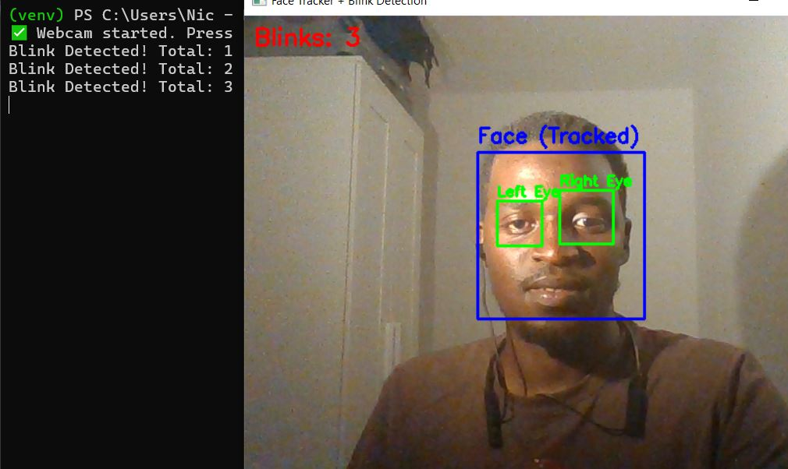

# 👁️ Face & Eye Detection Trainer (Python + OpenCV)

A simple real-time computer vision project to detect and label **faces** and **eyes** using Python and OpenCV. Ideal for learning face/eye detection and tracking basics.

## 🚀 Features

- Live webcam feed
- Face detection with bounding box and label
- Eye detection inside each face
- Labels: "Face", "Left Eye", "Right Eye"

## 🛠️ Requirements

- Python 3.8+
- OpenCV

Install dependencies:
```bash
python -m venv venv
source venv/bin/activate  # On Windows: venv\Scripts\activate
pip install -r requirements.txt
````

## 🧪 How to Run

```bash
python face_eye_detection_tracking.py
```

Press `cmd/ctrl + c` to quit the webcam window.

## 📸 Output

* Blue rectangle → Detected face
* Green rectangles → Left and right eyes
* Text labels for clarity

---

## Demo

